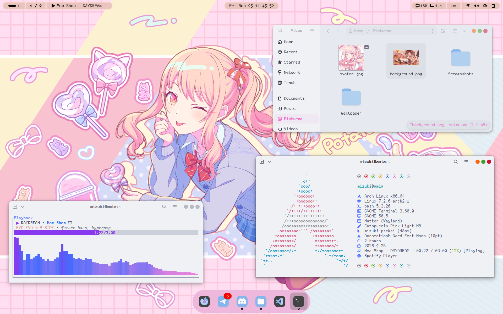
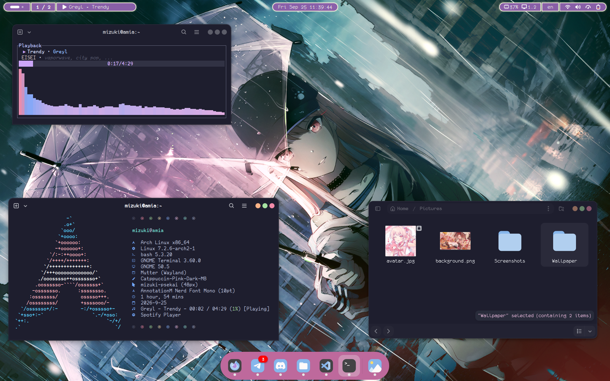
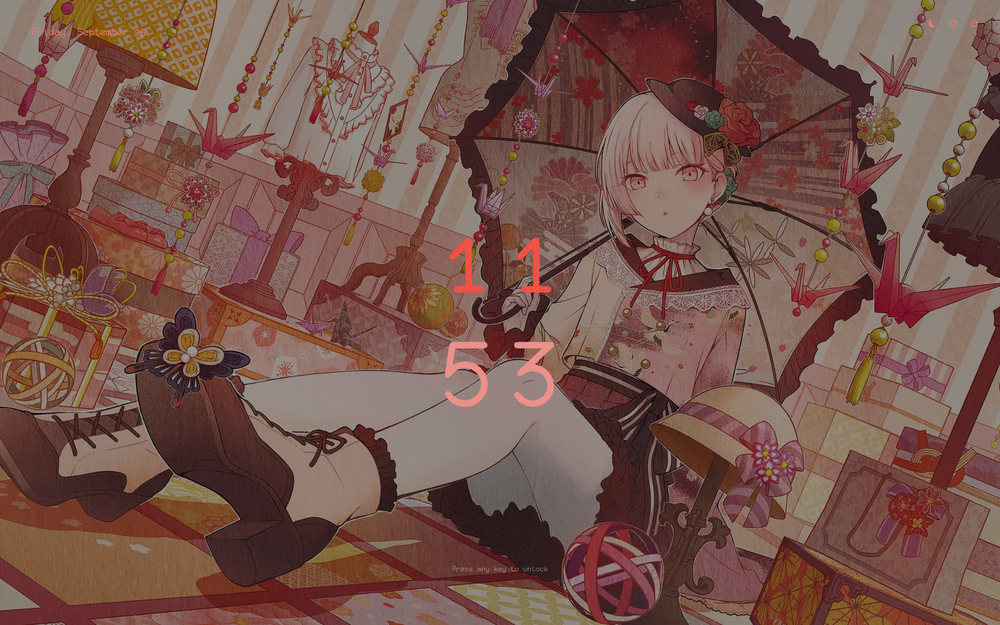
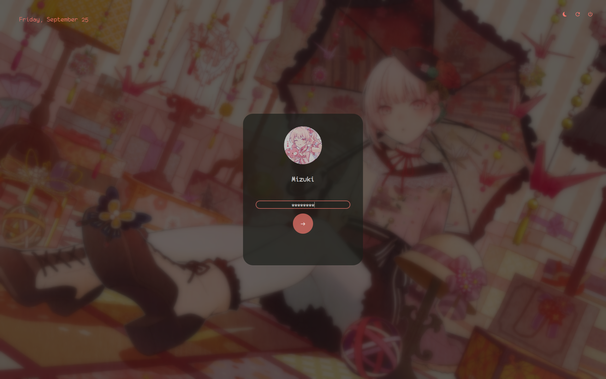

# amiArch Mizoox

An Arch Linux setup in a theme of Akiyama Mizuki from Project SEKAI.

## Setup
* OS: Arch Linux
* Window Manager: GNOME 50.5
* Terminal: GNOME Terminal
* Greeter: SDDM (themed using Pixie)
* Shell: starship
* Launcher: albert
* Font: Annotation Mono Nerd Font, Monofur Nerd Font 
* Light Color Scheme: Catppuccin Pink Latte
* Dark Color Scheme: Catppuccin Pink Mocha
* Extensions: Open Bar, Vitals, Just Perfection, Now Playing, Dash to Dock, Rounded Corners 
* Cursor: PJSK Mizuki Animated Cursor
* Sounds: Plasma Overdose (Needy Streamer Overload Sound)

## Screenshots

### Light Theme

### Dark Theme

### Login Screen

